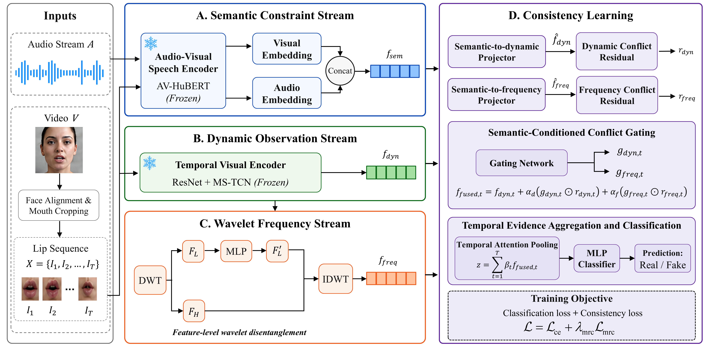

# TriCon: Semantic--Dynamic--Frequency Consistency Learning for Audio-Driven Talking Face Forgery Detection

<div align="center">

[](https://github.com/xuejianhuang/TriCon)
[](https://www.python.org/)
[](https://pytorch.org/)
[](LICENSE)

</div>

---

## Overview

This repository provides the official implementation of **TriCon**, a semantic--dynamic--frequency consistency learning framework for audio-driven talking face forgery detection. TriCon is designed for high-intelligibility talking face forgeries, where lip movements can be well synchronized with speech and conventional artifact-based or synchronization-mismatch cues may become unreliable.

TriCon models talking face forgery detection as a cross-domain consistency problem. It jointly exploits audio--visual semantic constraints, observed lip dynamics, and feature-level wavelet frequency responses to identify subtle inconsistencies that remain difficult for current audio-driven generation models to synthesize faithfully.

<div align="center">
  
  <br>
  <em>Fig. 1: Overall framework of the proposed TriCon.</em>
</div>

---

## Repository Structure

```text
TriCon/
|-- av_hubert/                 # Local AV-HuBERT code used by the semantic stream
|   `-- avhubert/              # AV-HuBERT models, configs, preparation, and clustering utilities
|-- data/
|   `-- 20words_mean_face.npy  # Mean face template used for mouth ROI alignment and cropping
|-- dynamic/                   # ResNet-18 + MS-TCN visual dynamic encoder
|   |-- data/                  # Dynamic encoder datasets, transforms, and samplers
|   `-- models/                # ResNet, MS-TCN, and dynamic model configurations
|-- figs/
|   `-- model.png              # TriCon framework figure used in this README
|-- hybrid_forensics/
|   |-- datasets/              # Cached feature dataset and dataloader
|   |-- inference/             # AV-HuBERT and dynamic feature extraction wrappers
|   |-- models/                # TriCon model, wavelet stream, and checkpoint loaders
|   |-- preprocessing/         # Landmark extraction, mouth cropping, audio extraction, and frequency utilities
|   `-- training/              # PyTorch Lightning training entry point
|-- scripts/
|   |-- extract_features.py    # Cache semantic and dynamic features
|   `-- evaluate_tricon.py     # Evaluate cached features with a trained checkpoint
|-- requirements.txt           # Python dependency list
|-- __main__.py                # Command-line preprocessing entry point
`-- README.md
```

---

## Datasets

The experiments in the paper use two high-intelligibility audio-driven talking face forgery datasets and one conventional face forgery dataset.

<div align="center">

| Dataset | Scenario |
| --- | --- |
| [AVLips](https://drive.google.com/file/d/1fEiUo22GBSnWD7nfEwDW86Eiza-pOEJm/view?usp=share_link) | High-quality lip-sync forgery detection with Wav2Lip, SadTalker, TalkLip, and MakeItTalk |
| [FakeAVCeleb](https://github.com/DASH-Lab/FakeAVCeleb) | Multimodal audio--video deepfake detection with Wav2Lip, FSGAN, FaceSwap, RTVC, and hybrid pipelines |
| [FaceForensics++](https://drive.google.com/file/d/1Cu1JVmAoTbssAQ290DxNVnaBdRmEotWP/view?usp=sharing) | Conventional face manipulation detection with Deepfakes, Face2Face, FaceSwap, and NeuralTextures |

</div>

---

## Baseline Methods

The paper compares TriCon with ten representative baselines from visual-only, frequency-aware, and audio--visual consistency families.

### Visual-only detectors

- [XceptionNet](https://github.com/ondyari/FaceForensics)
- [Face X-ray](https://github.com/neverUseThisName/Face-X-Ray)
- [LipForensics](https://github.com/ahaliassos/LipForensics)
- [SBI](https://github.com/mapooon/SelfBlendedImages)
- [RealForensics](https://github.com/ahaliassos/RealForensics)

### Frequency-aware detectors

- [F3-Net](https://github.com/Leminhbinh0209/F3Net)
- [FreqNet](https://github.com/chuangchuangtan/FreqNet-DeepfakeDetection)
- [PwTF-DVD](https://github.com/rama0126/PwTF-DVD)

### Audio--visual consistency detectors

- [AV-Lip-Sync+](https://doi.org/10.1109/THMS.2025.3618409)
- [LipFD](https://github.com/AaronComo/LipFD)

---

## Environment

The following environment is recommended for reproducing the paper-scale experiments.

<div align="center">

| Item | Recommended Setting |
| --- | --- |
| Python | `3.9` or `3.10` |
| CUDA | `11.7+` |
| PyTorch | `1.13+` or `2.0+` |
| GPU | NVIDIA A40 48 GB for full experiments; at least 24 GB VRAM is recommended for training |
| CPU / RAM | 16+ CPU cores and 64 GB RAM are recommended for large-scale preprocessing |

</div>

Core Python dependencies include:

```text
torch
torchvision
pytorch-lightning
fairseq
numpy
scipy
scikit-learn
opencv-python
Pillow
tqdm
PyWavelets
soundfile
python_speech_features
PyYAML
face-alignment
```

---

## Installation

```bash
conda create -n tricon python=3.10 -y
conda activate tricon

# Install PyTorch according to your CUDA version.
# Example for CUDA 11.8:
pip install torch torchvision --index-url https://download.pytorch.org/whl/cu118

# Install project dependencies.
pip install pytorch-lightning scikit-learn opencv-python Pillow tqdm PyWavelets soundfile python_speech_features PyYAML scipy

# Install AV-HuBERT / Fairseq dependencies.
git clone https://github.com/facebookresearch/av_hubert.git
cd av_hubert
git submodule init
git submodule update
pip install -r requirements.txt
cd fairseq
pip install --editable ./
cd ../..
```

---

## Checkpoints

Pretrained model checkpoints can be downloaded from:

- [Baidu Cloud](https://pan.baidu.com/s/1kt3h6bvdFJjBpHKYGC1qhA?pwd=thlk)

---

## Data Preparation

The expected raw dataset layout is:

```text
data/
|-- videos/
|   |-- sample_0001.mp4
|   |-- sample_0002.mp4
|   `-- ...
|-- train_list.txt
|-- val_list.txt
`-- test_list.txt
```

The preprocessing and feature extraction pipeline will create the following directories:

```text
data/
|-- landmarks/
|-- cropped_mouths/
|   `-- <video_id>/
|       |-- speech_mouth.mp4
|       `-- lip_mouth/
|-- audio/
|-- cached_features/
|   `-- <video_id>/
|       |-- speech_features.pt
|       `-- dynamic_features.pt
`-- frequent_features/        # Optional legacy / ablation features
```

---

## Running TriCon

### 1. Extract Facial Landmarks

```bash
python -m hybrid_forensics.preprocessing.extract_landmarks \
  --video_root data/videos \
  --file_list data/train_list.txt \
  --output_dir data/landmarks \
  --face_detector checkpoints/Resnet50_Final.pth \
  --num_workers 4
```

### 2. Crop Mouth Regions

```bash
python -m hybrid_forensics.preprocessing.crop_mouths \
  --video_root data/videos \
  --landmarks_dir data/landmarks \
  --file_list data/train_list.txt \
  --output_dir data/cropped_mouths \
  --mean_face data/20words_mean_face.npy \
  --crop_width 96 \
  --crop_height 96 \
  --num_workers 8 \
  --skip_existing
```

This step creates two types of mouth-region inputs:

- `speech_mouth.mp4` for the **AV-HuBERT semantic stream**.
- `lip_mouth/*.png` for the **ResNet-18 + MS-TCN dynamic stream**.

### 3. Extract Audio

```bash
python -m hybrid_forensics.preprocessing.extract_audio \
  --video_root data/videos \
  --file_list data/train_list.txt \
  --output_dir data/audio \
  --ffmpeg /usr/bin/ffmpeg \
  --sample_rate 16000
```

### 4. Cache Semantic and Dynamic Features

```bash
python scripts/extract_features.py \
  --video_list data/train_list.txt \
  --speech_mouth_dir data/cropped_mouths \
  --speech_audio_dir data/audio \
  --dynamic_mouth_dir data/cropped_mouths \
  --output_dir data/cached_features \
  --checkpoint_path checkpoints/av_hubert/large_vox_iter5.pt \
  --dynamic_model_path checkpoints/dynamic/dynamic_ff.pth \
  --frames_per_clip 25
```

Repeat this step for the validation and test splits. Alternatively, use separate output roots such as:

```text
data/cached_features/train
data/cached_features/val
data/cached_features/test
```

---

## Training

```bash
python -m hybrid_forensics.training.train_tricon \
  --model_type TriCon \
  --use_frequent \
  --train_feature_dir data/cached_features/train \
  --val_feature_dir data/cached_features/val \
  --train_file_list data/train_list.txt \
  --val_file_list data/val_list.txt \
  --epochs 10 \
  --batch_size 32 \
  --lr 1e-3 \
  --weight_decay 1e-4 \
  --contrast_weight 0.5 \
  --contrast_margin 0.5 \
  --class_weight balanced \
  --seq_len 25 \
  --save_dir checkpoints/main \
  --log_dir logs/main \
  --devices 1 \
  --seed 42
```

Key arguments are summarized below.

| Argument | Description |
| --- | --- |
| `--contrast_weight` | Weight of the margin-based residual consistency loss |
| `--contrast_margin` | Residual margin `rho` for forged samples |
| `--class_weight balanced` | Computes class weights from the training split |
| `--seq_len 25` | Temporal length `T_c` used by TriCon |
| `--use_per_clip` | Predicts each clip independently and averages clip-level predictions at the video level |

---

## Evaluation

```bash
python scripts/evaluate_tricon.py \
  --feature_dir data/cached_features/test \
  --file_list data/test_list.txt \
  --checkpoint checkpoints/main/best_TriCon.ckpt \
  --output_dir results/main \
  --batch_size 16 \
  --seq_len 25 \
  --threshold 0.5
```

---

## Acknowledgements

This implementation builds on public resources from **AV-HuBERT**, **face-alignment**, **LipForensics / ResNet-18 + MS-TCN**, and the deepfake detection community. We thank the authors of the datasets and baseline methods for releasing their data, code, and pretrained models.
